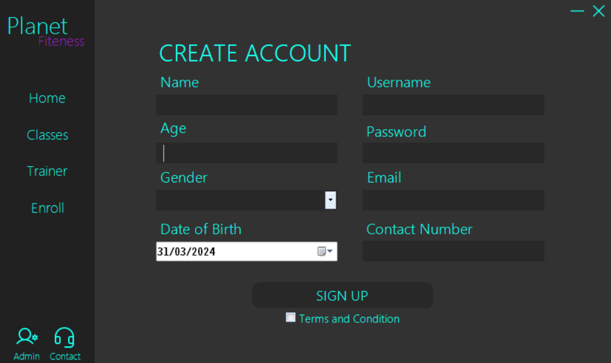
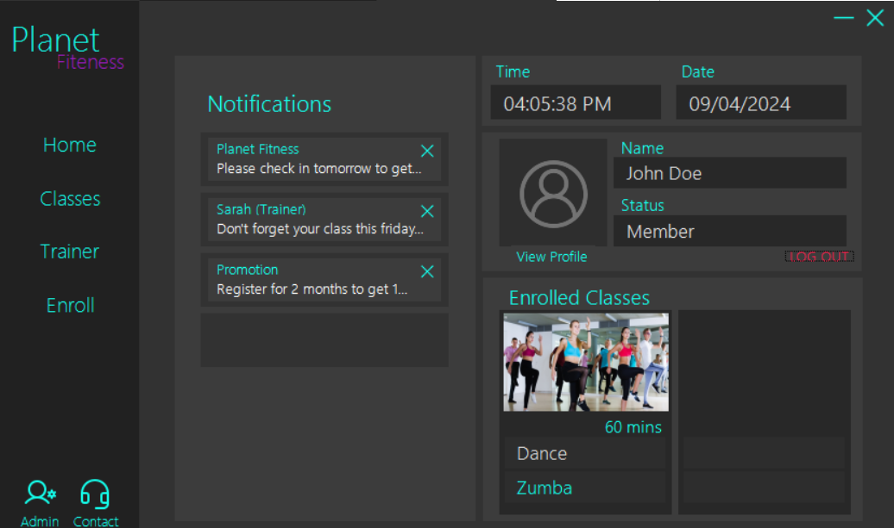
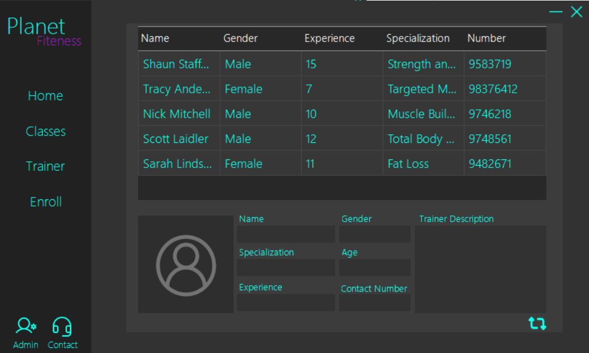
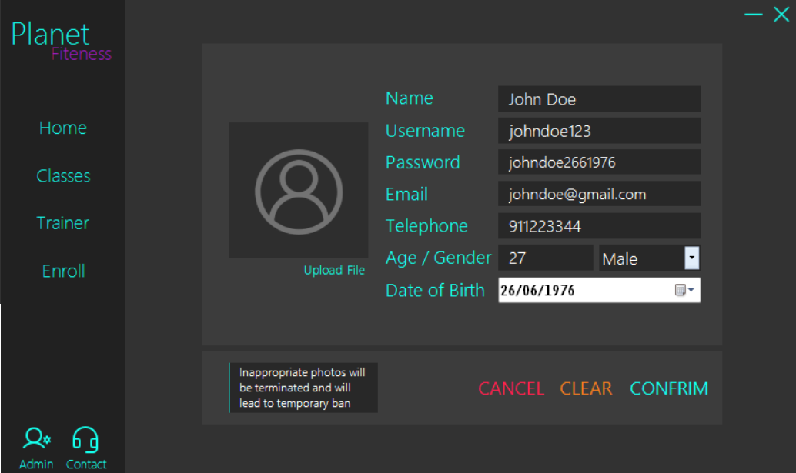
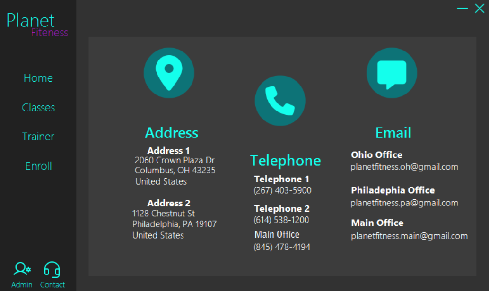
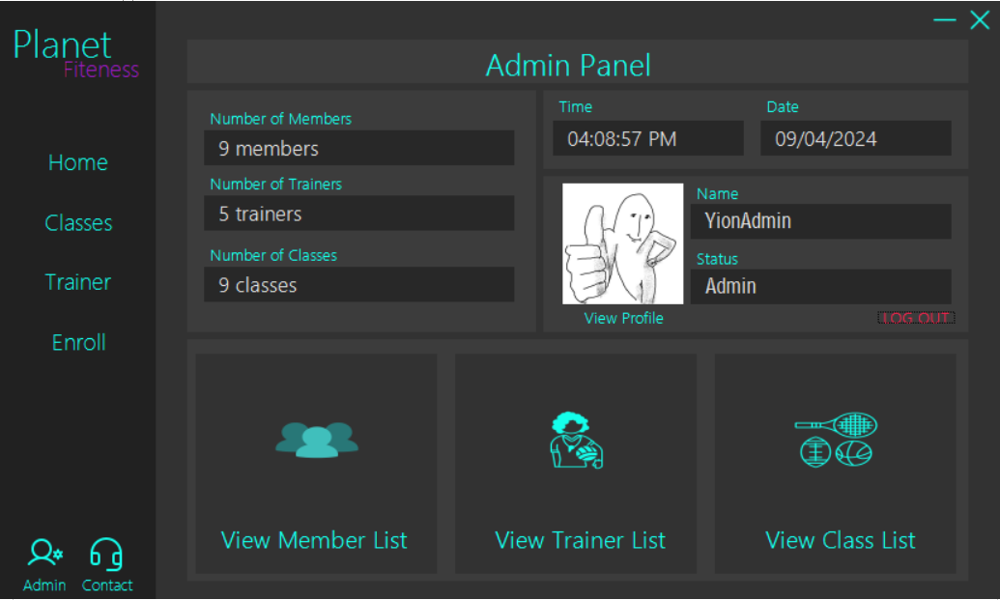
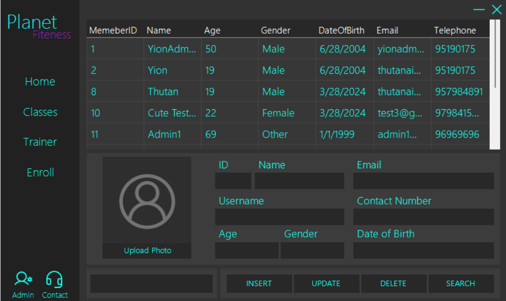

# Gym-System WinForms App

<!-- ABOUT THE PROJECT -->
### About The Project
- The application is created for school project.
- Created within 2 weeks

### Built With
* 
* 
*  Krypton Suite

<!-- Screenshots -->
## Screenshots

<!-- LICENSE -->
## License

Distributed under the MIT License. See `LICENSE.txt` for more information.

<!-- CONTACT -->
## Contact

Your Name - Thuta Naing | thutanaing.personal@gmail.com  
Linkedin  - [Thuta Naing](www.linkedin.com/in/thuta-naing-83b5222b0) 
Discord   - [yion69](https://discord.com/users/444166064398663680) 
Project Link: [https://github.com/your_username/repo_name](https://github.com/your_username/repo_name) 
